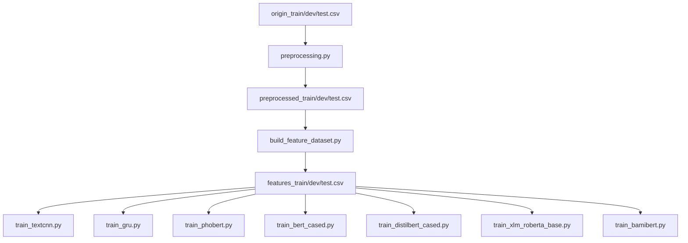

# Tài liệu Kỹ thuật: Pipeline ViHSD (Cập nhật theo code hiện tại)

## 1. Mục tiêu và phạm vi

Tài liệu này mô tả đúng luồng xử lý đang được triển khai trong mã nguồn hiện tại của dự án, từ dữ liệu gốc đến huấn luyện và xuất artifact.

Phạm vi gồm:
- Tiền xử lý văn bản (src/preprocessing.py + src/preprocessing_dic.py)
- Sinh bộ dữ liệu đặc trưng (src/build_feature_dataset.py)
- Huấn luyện 3 họ mô hình:
  - TextCNN + meta-features (src/train_textcnn.py)
  - GRU + meta-features (src/train_gru.py)
  - Transformer + meta-features (src/train_phobert.py và các wrapper)

## 2. Sơ đồ pipeline end-to-end

## 3. Giai đoạn 1: Tiền xử lý văn bản

### 3.1. Cấu trúc thành phần

- src/preprocessing.py: pipeline xử lý chính
- src/preprocessing_dic.py: chứa bộ từ điển SLANG/ABBREV/COMPOUND và STOPWORDS

### 3.2. Trình tự 7 bước đang chạy thực tế

Trong hàm run_pipeline, dữ liệu đi qua 7 bước theo đúng thứ tự:

1. Unicode normalization NFC
2. Loại nhiễu kỹ thuật (URL, mention, hashtag)
3. Trích xuất emoji thành token EMOJI_ALIAS_*
4. Chuẩn hóa kéo dài:
   - dấu câu lặp sinh tag cường độ PUNC_*
   - ký tự chữ lặp >= 3 rút còn 1
5. Chuẩn hóa teencode/từ lóng bằng ABBREV rồi SLANG
6. Gộp từ ghép bằng COMPOUND pattern (ưu tiên cụm dài hơn)
7. Word segmentation bằng underthesea + lọc stopwords (giữ lại các từ phủ định quan trọng)

Kết quả lưu ra:
- dataset-vihsd/preprocessed_train.csv
- dataset-vihsd/preprocessed_dev.csv
- dataset-vihsd/preprocessed_test.csv

Mỗi file output chứa 2 cột:
- clean_text
- label_id

### 3.3. Điểm kỹ thuật cần lưu ý

- Từ điển raw được normalize về NFC khi khởi tạo thành SLANG_DICT/ABBREV_DICT/COMPOUND_DICT.
- Hàm thay từ lóng hiện tại tra cứu bằng token.lower() nên không phụ thuộc hoa/thường của input.
- Pipeline chính không ép lower toàn câu trước xử lý; chỉ self-test có .lower().

## 4. Giai đoạn 2: Sinh đặc trưng (meta-features)

Script: src/build_feature_dataset.py

Input:
- preprocessed_train/dev/test.csv

Output:
- features_train.csv
- features_dev.csv
- features_test.csv

Mỗi dòng output gồm:
- tokens_text: giữ nguyên clean_text (dạng có underscore, dùng cho PhoBERT)
- transformer_text: thay underscore bằng khoảng trắng (dùng cho mô hình multilingual/BamiBERT)
- 13 đặc trưng meta
- label_id

Danh sách 13 đặc trưng:
- feat_log_num_tokens
- feat_log_num_chars
- feat_avg_token_len
- feat_emoji_density
- feat_punct_density
- feat_upper_ratio
- feat_digit_ratio
- feat_bad_word_density
- feat_elongated_ratio
- feat_exclamation_density
- feat_allcaps_ratio
- feat_laugh_density
- feat_aggressive_pronoun

## 5. Giai đoạn 3: Huấn luyện mô hình

## 5.1. TextCNN + meta-features

Script: src/train_textcnn.py

Luồng chính:
- Đọc features_*.csv
- Oversampling train set theo rule cứng:
  - lớp 1 nhân 5
  - lớp 2 nhân 3
- Build vocab từ train đã oversample
- Nạp FastText từ cc.vi.300.vec (lọc theo vocab)
- Train TextCNN và chọn best theo dev F1-macro
- Early stopping theo patience
- Evaluate test với threshold moving:
  - nếu p[class_2] > 0.25 -> predict lớp 2
  - else nếu p[class_1] > 0.25 -> predict lớp 1
  - else dùng argmax

Kiến trúc:
- Embedding -> Conv1d kernels (3,4,5) -> max-pooling -> concat
- Meta branch: BatchNorm1d -> Linear -> ReLU -> Dropout
- Fused vector -> Linear classifier

Optimizer/Loss/Scheduler:
- Adam
- CrossEntropyLoss
- ReduceLROnPlateau(mode=max, factor=0.5, patience=2)

Artifact xuất ra models/textcnn:
- best_textcnn.pt
- confusion_matrix_test.csv
- ovr_metrics_test.csv
- misclassified_test.csv

Ghi chú đúng theo code hiện tại:
- File có class FocalLoss nhưng không được dùng trong luồng train chính.
- Trong class TextCNN, lớp embedding được gán lại một lần nữa bằng nn.Embedding sau block nạp pretrained, nên nhánh pretrained FastText hiện không còn hiệu lực trong forward của model.

## 5.2. GRU + meta-features

Script: src/train_gru.py

Luồng chính tương tự TextCNN, gồm:
- Oversampling train set cùng rule (1x5, 2x3)
- Threshold moving khi evaluate test (ngưỡng 0.25 cho lớp 2 và lớp 1)
- Best model theo dev F1-macro + early stopping

Khác biệt chính:
- Text input được lower ngay lúc load_split (str.lower())
- Encoder là GRU (mean pooling có mask)
- Có hỗ trợ embedding pretrained FastText và tự đồng bộ embed_dim nếu lệch với vector dim

Optimizer/Loss/Scheduler:
- Adam
- CrossEntropyLoss
- ReduceLROnPlateau(mode=max, factor=0.5, patience=2)

Artifact xuất ra models/gru:
- best_gru.pt
- confusion_matrix_test.csv
- ovr_metrics_test.csv
- misclassified_test.csv

## 5.3. Transformer + meta-features (shared pipeline)

Script lõi: src/train_phobert.py

Các wrapper gọi chung run_experiment:
- src/train_phobert.py
- src/train_bert_cased.py
- src/train_distilbert_cased.py
- src/train_xlm_roberta_base.py
- src/train_bamibert.py

Kiến trúc fusion:
- Text branch: lấy hidden state tại vị trí đầu (last_hidden_state[:, 0, :]) + Dropout
- Meta branch: LayerNorm -> Linear(feature_hidden_size=64) -> GELU -> Dropout(0.2)
- Concat text + meta -> Linear classifier

Chiến lược train:
- Không oversampling
- Loss: F.cross_entropy
- Optimizer: AdamW
- Scheduler: linear warmup (warmup_ratio=0.1)
- Gradient clipping: max_norm=1.0
- Early stopping theo dev F1-macro (patience=2)
- Dự đoán bằng argmax (không threshold moving)

Default model/text column:
- PhoBERT: vinai/phobert-base, text_column=tokens_text
- BERT m-cased: bert-base-multilingual-cased, text_column=transformer_text
- DistilBERT m-cased: distilbert-base-multilingual-cased, text_column=transformer_text
- XLM-R: xlm-roberta-base, text_column=transformer_text
- BamiBERT: Qualcomm-AI-Research/BamiBERT, text_column=transformer_text

Tokenizer handling:
- BamiBERT: PreTrainedTokenizerFast
- PhoBERT: AutoTokenizer(use_fast=False)
- Mô hình khác: AutoTokenizer(use_fast=True)

Artifact xuất ra models/<subdir>:
- best_transformer_with_features.pt
- tokenizer files
- config.json (encoder config)
- label_mapping.csv

Lưu ý:
- Nhánh Transformer hiện chỉ in confusion matrix/F1 ra console, không xuất misclassified_test.csv hoặc ovr_metrics_test.csv.

## 6. Tổng hợp artifact đầu ra

Sau khi chạy đầy đủ pipeline, các nhóm file chính gồm:

- Dữ liệu trung gian:
  - preprocessed_train/dev/test.csv
  - features_train/dev/test.csv
- Mô hình CNN/RNN:
  - best_textcnn.pt, best_gru.pt
  - confusion_matrix_test.csv
  - ovr_metrics_test.csv
  - misclassified_test.csv
- Mô hình Transformer:
  - best_transformer_with_features.pt
  - tokenizer + config + label_mapping.csv

## 7. Thứ tự chạy khuyến nghị

1. Chạy tiền xử lý:
   - python src/preprocessing.py
2. Chạy sinh đặc trưng:
   - python src/build_feature_dataset.py
3. Chạy huấn luyện mô hình mong muốn:
   - python src/train_textcnn.py
   - python src/train_gru.py
   - python src/train_phobert.py
   - python src/train_bert_cased.py
   - python src/train_distilbert_cased.py
   - python src/train_xlm_roberta_base.py
   - python src/train_bamibert.py
