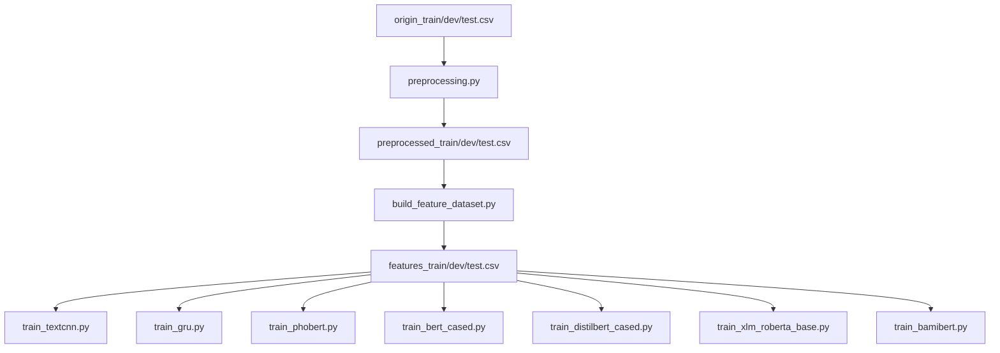

# Tài liệu Kỹ thuật: Pipeline ViHSD trong workspace hiện tại

## 1. Mục tiêu và phạm vi

README này mô tả đúng luồng xử lý đang có trong workspace `Social_Media_Mining`, từ dữ liệu gốc đến dữ liệu trung gian, huấn luyện mô hình, và các artifact đã được lưu sẵn.

Phạm vi gồm:
- Tiền xử lý văn bản: `src/preprocessing.py` và `src/preprocessing_dic.py`
- Sinh bộ dữ liệu đặc trưng: `src/build_feature_dataset.py`
- Huấn luyện mô hình cổ điển: `src/train_textcnn.py`, `src/train_gru.py`
- Huấn luyện mô hình Transformer + meta-features: `src/train_phobert.py` và các wrapper
- Web demo suy luận: `web_demo/app.py`

## 2. Cấu trúc workspace

Các thư mục chính đang có trong workspace:

- `dataset-vihsd/`: dữ liệu gốc, dữ liệu tiền xử lý, file feature, FastText và tài liệu dataset
- `src/`: code tiền xử lý, xây feature, huấn luyện model
- `models/`: artifact mô hình đã train sẵn
- `web_demo/`: ứng dụng Flask để demo dự đoán

Artifact hiện có trong workspace:

- `models/gru/`
  - `gru_best_model.pt`
  - `gru_confusion_matrix_test.csv`
  - `gru_misclassified_test.csv`
  - `gru_ovr_metrics_test.csv`
- `models/textcnn/`
  - `textcnn_best_model.pt`
  - `textcnn_confusion_matrix_test.csv`
  - `textcnn_misclassified_test.csv`
  - `textcnn_ovr_metrics_test.csv`

## 3. Sơ đồ pipeline end-to-end

## 4. Giai đoạn 1: Tiền xử lý văn bản

### 4.1. Thành phần

- `src/preprocessing.py`: pipeline xử lý chính
- `src/preprocessing_dic.py`: từ điển `SLANG`, `ABBREV`, `COMPOUND`, và `STOPWORDS`

### 4.2. Luồng xử lý thực tế

Trong `run_pipeline`, dữ liệu đi qua 7 bước theo đúng thứ tự:

1. Unicode normalization NFC và chuẩn hóa một số kiểu gõ dấu cũ sang mới
2. Loại nhiễu kỹ thuật như URL, mention, hashtag
3. Trích xuất emoji thành token `EMOJI_ALIAS_*`
4. Chuẩn hóa kéo dài:
   - dấu câu lặp sinh tag cường độ `PUNC_*`
   - ký tự chữ lặp từ 3 lần trở lên được rút về 1 ký tự
5. Chuẩn hóa teencode/từ lóng qua `ABBREV` rồi `SLANG`
6. Gộp từ ghép theo `COMPOUND` với ưu tiên cụm dài hơn
7. Word segmentation bằng underthesea + lọc stopwords, giữ lại các từ phủ định quan trọng

### 4.3. Input và output

Script đọc:

- `dataset-vihsd/origin_train.csv`
- `dataset-vihsd/origin_dev.csv`
- `dataset-vihsd/origin_test.csv`

Cột đầu vào chính là `free_text`, nhãn là `label_id`.

Script ghi ra:

- `dataset-vihsd/preprocessed_train.csv`
- `dataset-vihsd/preprocessed_dev.csv`
- `dataset-vihsd/preprocessed_test.csv`

Mỗi file output chỉ giữ 2 cột:

- `clean_text`
- `label_id`

### 4.4. Lưu ý kỹ thuật

- Từ điển raw được normalize về NFC khi khởi tạo thành `SLANG_DICT`, `ABBREV_DICT`, `COMPOUND_DICT`.
- Hàm thay từ lóng tra cứu bằng `token.lower()`, nên không phụ thuộc hoa/thường đầu vào.
- Pipeline chính không ép `.lower()` toàn câu trước xử lý; chỉ phần self-test nhanh có làm vậy.

## 5. Giai đoạn 2: Sinh đặc trưng (meta-features)

Script: `src/build_feature_dataset.py`

### 5.1. Input và output

Input:

- `preprocessed_train.csv`
- `preprocessed_dev.csv`
- `preprocessed_test.csv`

Output:

- `features_train.csv`
- `features_dev.csv`
- `features_test.csv`

### 5.2. Cấu trúc từng dòng output

Mỗi dòng gồm:

- `tokens_text`: giữ nguyên `clean_text` dạng có underscore, dùng cho PhoBERT
- `transformer_text`: thay underscore bằng khoảng trắng, dùng cho các Transformer multilingual/BamiBERT
- 10 đặc trưng meta
- `label_id`

### 5.3. Danh sách 10 đặc trưng hiện tại

- `feat_log_num_tokens`
- `feat_upper_ratio`
- `feat_emoji_density`
- `feat_bad_word_density`
- `feat_aggressive_pronoun`
- `feat_laugh_density`
- `feat_sarcastic_punct`
- `feat_scare_quotes`
- `feat_intensifier_words`
- `feat_elongated_ratio`

## 6. Giai đoạn 3: Huấn luyện mô hình

## 6.1. TextCNN + meta-features

Script: `src/train_textcnn.py`

### Luồng chính

- Đọc `features_train/dev/test.csv`
- Oversampling train set theo rule cứng:
  - lớp 1 nhân 5
  - lớp 2 nhân 3
- Build vocab từ train sau oversampling
- Nạp FastText từ `dataset-vihsd/cc.vi.300.vec` nếu file tồn tại
- Train TextCNN và chọn best theo dev F1-macro
- Early stopping theo `patience`
- Evaluate test với threshold moving:
  - nếu `p[class_2] > 0.3` thì predict lớp 2
  - nếu không, và `p[class_1] > 0.3` thì predict lớp 1
  - còn lại dùng `argmax`

### Kiến trúc

- Embedding -> Conv1d kernels `(3, 4, 5)` -> max-pooling -> concat
- Meta branch: BatchNorm1d -> Linear -> SiLU -> Dropout
- Fused vector -> Linear classifier

### Optimizer / loss / scheduler

- Adam
- CrossEntropyLoss
- ReduceLROnPlateau với `mode=max`, `factor=0.5`, `patience=2`

### Artifact xuất ra `models/textcnn/`

- `textcnn_best_model.pt`
- `textcnn_confusion_matrix_test.csv`
- `textcnn_ovr_metrics_test.csv`
- `textcnn_misclassified_test.csv`

### Ghi chú theo code hiện tại

- `train_textcnn.py` vẫn có class `FocalLoss`, nhưng luồng train chính không dùng.
- Nhánh pretrained FastText hiện vẫn được nạp vào model khi có vector khớp vocab.

## 6.2. GRU + meta-features

Script: `src/train_gru.py`

### Luồng chính

- Đọc `features_train/dev/test.csv`
- Text được lower ngay lúc load split
- Oversampling train set theo cùng rule:
  - lớp 1 nhân 5
  - lớp 2 nhân 3
- Nạp FastText nếu có và tự đồng bộ `embed_dim` nếu lệch với dim vector
- Train GRU và chọn best theo dev F1-macro
- Early stopping theo `patience`
- Evaluate test với threshold moving:
  - nếu `p[class_2] > 0.3` thì predict lớp 2
  - nếu không, và `p[class_1] > 0.3` thì predict lớp 1
  - còn lại dùng `argmax`

### Khác biệt chính so với TextCNN

- Encoder là GRU với mean pooling có mask
- Có embedding pretrained FastText và tự đồng bộ số chiều vector nếu cần

### Optimizer / loss / scheduler

- Adam
- CrossEntropyLoss
- ReduceLROnPlateau với `mode=max`, `factor=0.5`, `patience=2`

### Artifact xuất ra `models/gru/`

- `gru_best_model.pt`
- `gru_confusion_matrix_test.csv`
- `gru_ovr_metrics_test.csv`
- `gru_misclassified_test.csv`

## 6.3. Transformer + meta-features

Script lõi: `src/train_phobert.py`

Các wrapper gọi chung `run_experiment`:

- `src/train_phobert.py`
- `src/train_bert_cased.py`
- `src/train_distilbert_cased.py`
- `src/train_xlm_roberta_base.py`
- `src/train_bamibert.py`

### Kiến trúc fusion

- Text branch: lấy hidden state tại vị trí đầu `last_hidden_state[:, 0, :]` rồi dropout
- Meta branch: normalization -> Linear -> SiLU/GELU -> dropout
- Concat text + meta -> Linear classifier

### Chiến lược train

- Không oversampling mặc định trong `train_phobert.py`, nhưng BamiBERT wrapper có tùy chọn bật oversampling
- Loss: `F.cross_entropy`
- Trọng số lớp được tính từ phân phối train và đưa vào loss
- Optimizer: AdamW
- Scheduler: linear warmup với `warmup_ratio=0.1`
- Gradient clipping: `max_norm=1.0`
- Early stopping theo dev F1-macro
- Dự đoán mặc định bằng `argmax`
- `train_bamibert.py` có tùy chọn bật threshold moving nếu cần

### Default model / text column

- PhoBERT: `vinai/phobert-base`, `text_column=tokens_text`
- BERT multilingual cased: `bert-base-multilingual-cased`, `text_column=transformer_text`
- DistilBERT multilingual cased: `distilbert-base-multilingual-cased`, `text_column=transformer_text`
- XLM-R: `xlm-roberta-base`, `text_column=transformer_text`
- BamiBERT: `Qualcomm-AI-Research/BamiBERT`, `text_column=transformer_text`

### Tokenizer handling

- BamiBERT: `PreTrainedTokenizerFast`
- PhoBERT: `AutoTokenizer(use_fast=False)`
- Các model còn lại: `AutoTokenizer(use_fast=True)`

### Artifact xuất ra theo từng nhánh

- PhoBERT: `models/phobert/phobert_best_model.pt`
- BERT multilingual cased: `models/bert_cased/mbert_best_model.pt`
- DistilBERT multilingual cased: `models/distilbert_cased/distilbert_best_model.pt`
- XLM-R: `models/xlm_roberta_base/xlmr_best_model.pt`
- BamiBERT: `models/bamibert/best_transformer_with_features.pt`

Mỗi thư mục Transformer còn nhận thêm:

- tokenizer files
- `config.json`
- `label_mapping.csv`
- `confusion_matrix_test.csv`
- `ovr_metrics_test.csv`
- `misclassified_test.csv`

## 7. Web demo

`web_demo/app.py` là ứng dụng Flask phục vụ suy luận.

Điểm chính:

- Quét thư mục `models/` để tìm checkpoint đã train
- Hỗ trợ load cả `TextCNN`, `GRU`, và các Transformer đã lưu
- Dùng lại cùng pipeline tiền xử lý và cùng bộ feature khi dự đoán

## 8. Thứ tự chạy khuyến nghị

1. Chạy tiền xử lý:
   - `python src/preprocessing.py`
2. Chạy sinh đặc trưng:
   - `python src/build_feature_dataset.py`
3. Chạy huấn luyện mô hình mong muốn:
   - `python src/train_textcnn.py`
   - `python src/train_gru.py`
   - `python src/train_phobert.py`
   - `python src/train_bert_cased.py`
   - `python src/train_distilbert_cased.py`
   - `python src/train_xlm_roberta_base.py`
   - `python src/train_bamibert.py`
4. Chạy web demo sau khi đã có checkpoint trong `models/`:
   - `python web_demo/app.py`
